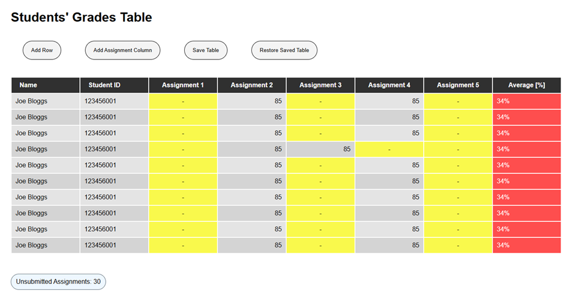

# Student Grades Table

A small web app for managing student grades.

This was a university assignment where the goal was to build an interactive grades table using only HTML, CSS and JavaScript. Users can enter grades, calculate averages, add new students and assignments, and save their work in the browser.

## Screenshot

## Features

- Enter and edit assignment grades only
- Automatic average calculations
- Switch between percentage, letter grades, and GPA
- Validation for invalid grade inputs
- Count unsubmitted assignments
- Highlight failing grades
- Add new students
- Add new assignment columns
- Save table data
- Restore saved data
- Delete and undelete rows and columns
- Custom right-click menu

## What I Learned

This project taught me a lot about how JavaScript can be used to modify a webpage after it has already loaded.

One of the biggest things I learned was how to create and delete HTML elements dynamically using .remove() and appendChild().

I also became more comfortable working with different types of event listeners. Before this project I mostly used click events, but here I learned about events like blur, which runs when a user finishes editing a table cell and clicks away from it. This was useful for validating grades and recalculating averages automatically.

Another thing I learned was the difference between methods like appendChild() and insertBefore(). appendChild() is useful when you simply want to add something to the end of an element, while insertBefore() gives more control and allows elements to be inserted at a specific position. This became important when adding new assignment columns or restoring deleted data.

Overall, this project helped me move beyond basic JavaScript and start building interfaces that react dynamically to user input.
